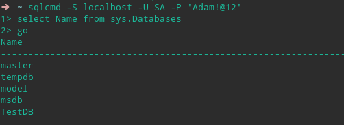

# Manjaro安装SQLServer

## 安装SQL Server

1. 运行命令`yaourt -S mssql-server`
   > 此为下载SQLSERVER安装包
2. 下载完成之后，安装SQLSERVER，`sudo /opt/mssql/bin/mssql-conf setup`
3. 验证服务是否正在运行`sudo /opt/mssql/bin/mssql-conf setup`
4. 如果打算远程连接， 可能还需要打开防火墙上的SQLSERVER TCP端口（1433）。

## 安装SQL Server命令行工具

1. 安装SQL Server命令行工具`yaourt -S mssql-tools`
    > 可选： 添加`/opt/mssql-tools/bin/`到你的bash shell中的环境变量（以下均没有使用过）
    >若要使sqlcmd/bcp可从登录会话的 bash shell 访问修改你路径中 ~/.bash_profile文件使用以下命令：
    >
    >``` bash
    >echo 'export PATH="$PATH:/opt/mssql-tools/bin"' >> ~/.bash_profile
    >```
    >
    >若要使sqlcmd/bcp能从交互式/非登录会话，bash shell 访问修改路径中 ~/.bashrc文件使用以下命令：
    >
    >``` bash
    >echo 'export PATH="$PATH:/opt/mssql-tools/bin"' >> ~/.bashrc
    >source ~/.bashrc
    >```

## [可选]安装SQL Operations Studio

## 测试数据库


