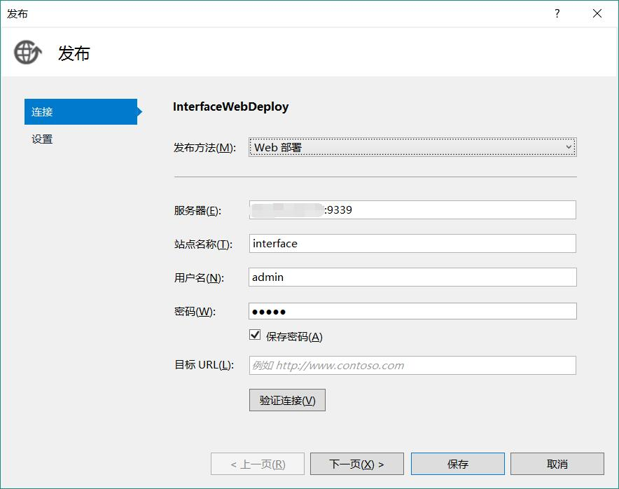

1. 准备文件
    1. 下载Web Deploy[下载地址](https://www.iis.net/downloads/microsoft/web-deploy)
2. 配置IIS
    1. 完整安装Web Deploy至服务器
    2. IIS首页 > 管理服务 > 
        1. 配置管理凭据 选XX或XX
        2. 配置端口
        3. 防火墙开放端口
          > 注意打开Web Deploy服务
    3. 新建用户 填写用户密码
    4. 新建网站
    5. IIS管理器权限: 允许刚刚新建的用户
    6. 配置网站目录权限, 允许权限主体LocalService完全控制
3. 本地连接
    1. 解决方案管理器 > 要发布的项目 > 发布
    2. 配置各个选项
        > 